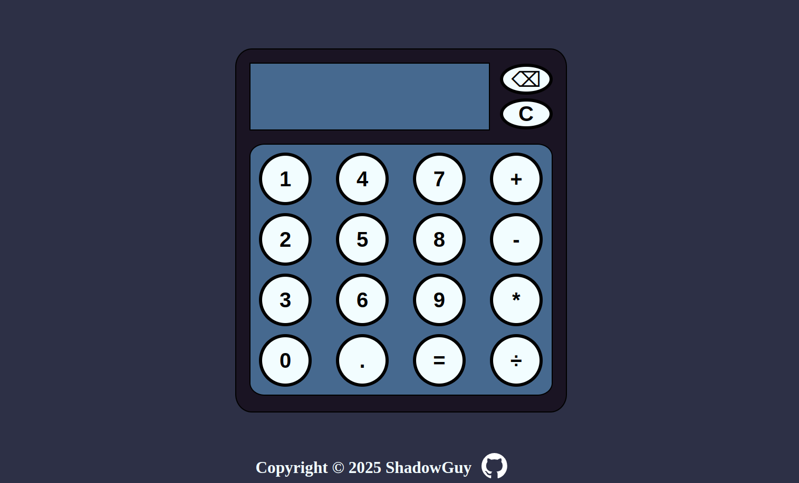

---

# JavaScript Calculator 🧮

A simple and intuitive web-based calculator built using HTML, CSS, and JavaScript. This project provides basic arithmetic operations with a user-friendly interface.

## Features ✨

- **Basic Arithmetic Operations**: Perform addition, subtraction, multiplication, and division.
- **Responsive Design**: Compatible with various screen sizes for seamless use on different devices.

## Technologies Used 🛠️

- **HTML**: Structuring the calculator's layout.
- **CSS**: Styling the calculator for an appealing look.
- **JavaScript**: Implementing the calculator's functionality.

## How to Use 🚀

1. **Clone the repository**:
   ```bash
   git clone https://github.com/ShadowGuy01234/JS-Calculator.git
   ```
2. **Navigate to the project directory**:
   ```bash
   cd JS-Calculator
   ```
3. **Open `index.html`** in your preferred web browser to start using the calculator.

## Preview 🖼




## Future Improvements 🚧

- **Advanced Operations**: Incorporate functionalities like exponentiation and square roots.
- **History Feature**: Display a log of recent calculations.
- **Theming Options**: Allow users to switch between different themes for a personalized experience.

## Contributing 🤝

Contributions are welcome! Feel free to open issues or submit pull requests to enhance the project.

## License 📜

This project is licensed under the [MIT License](LICENSE).
